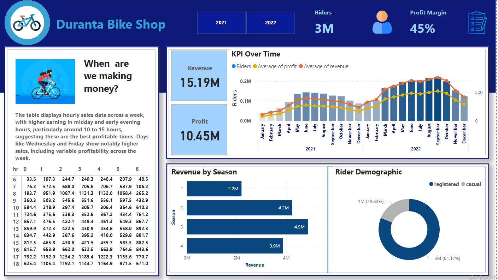

# Welcome to My GitHub Profile!

## About Me
I am a Data Analyst with a strong foundation in data analysis, visualization, and Python programming & Web development(Django) language. I have experience using tools like Python, Excel, SQL, and Power BI to extract insights from data and drive business decisions.

## Overview

This project involves the analysis of bike sales data for the years 2021 and 2022. By loading data from a SQL Server database and joining two datasets, a comprehensive dashboard was created using Power BI to visualize sales trends and factors affecting bike rentals.

## Skills
- **Data Analysis**: Proficient in analyzing datasets using Python (Pandas, NumPy) and Excel.
- **Data Visualization**: Experienced in creating dashboards and visualizations using Power BI and Tableau.
- **Database Management**: Knowledgeable in SQL for querying and managing relational databases.
- **Machine Learning**: Familiar with basic machine learning concepts and algorithms using Scikit-learn and TensorFlow.
- **Statistical Analysis**: Strong understanding of statistical methods to analyze data and derive insights.

## Projects
- **Sales Dashboard**: Developed an interactive dashboard in Power BI to visualize sales data, track KPIs, and identify trends.
- **Customer Segmentation**: Conducted data analysis and clustering using Python to segment customers based on purchasing behavior.
- **Exploratory Data Analysis (EDA)**: Performed EDA on various datasets to uncover insights and present findings to stakeholders.
- **Public Health Data Monitoring with Power BI**: Developed an interactive dashboard for real-time monitoring and reporting of health data trends, focusing on local health system performance.
-	**Health Sector Data Analysis with Python**: Conducted a trend analysis of public health service delivery, identifying key insights for program improvement
  
- **Supply Chain and Resource Optimization for Health Services**: Designed a real-time monitoring system for supply chain management, ensuring efficient resource allocation for public health services.
- **Market Trend Analysis and Interactive Dashboard**:Built a Power BI dashboard to visualize market trends, helping stakeholders make informed decisions on product development and marketing strategies. 

## Education
- **Master of Science (MSc) in Applied Mathematics**
  - University of Dhaka, 2023
- **Bachelor of Science (BSc) in Applied Mathematics**
  - University of Dhaka, 2021

## Contact Me
Feel free to connect with me on:
- **Email**: [your-email@example.com](mailto:your-email@example.com)
- **LinkedIn**: [linkedin.com/in/abdur-rafe](https://www.linkedin.com/in/abdur-rafe)
- **GitHub**: [github.com/scholarrafe](https://github.com/scholarrafe)

## Summary
I am passionate about leveraging data to drive decisions and am eager to learn and grow in the field of data analysis. Thank you for visiting my profile!
